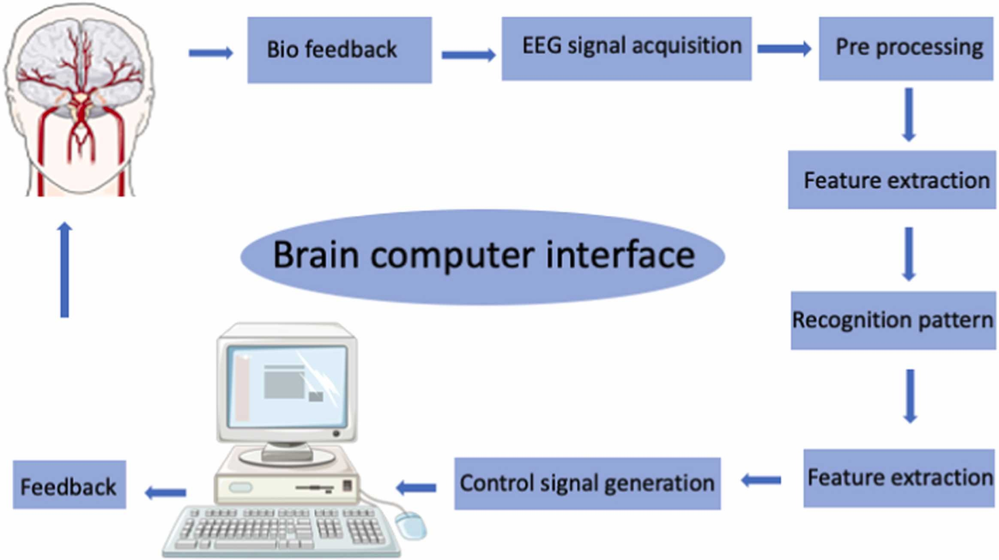

## Briefings in Bioinformatics, Oxford University Press, interdisziplinär als Teil der SIA Security Intelligence Artefact Research, The Yellow Whitepaper Series

**Isabel Schöps (Thiel). (2026). isabelschoeps-thiel/Bioinformatics-Oxford-University-Press: Briefings in Bioinformatics, Oxford University Press by Isabel Schöps geb. Thiel (oxford-1.2)**. Zenodo, GitHub, Oxford University Press UK, ScholarOne and Manuscript Central are registered trademarks of ScholarOne,Inc. [https://doi.org/10.5281/zenodo.20738622](https://doi.org/10.5281/zenodo.20738622)

[https://de.scribd.com/document/1054881530/SIA-Security-Intelligence-Bioinformatic-by-Isabel-Schops-geb-Thiel](https://de.scribd.com/document/1054881530/SIA-Security-Intelligence-Bioinformatic-by-Isabel-Schops-geb-Thiel)

Autorin: Frau Isabel Schöps, geborene Thiel

Aktueller Bearbeitungsstand: Mittwoch, 17. Juni 2026

Aktueller Aufenthaltsort: Lassalle-Straße 47, Apartment 38, D-99086 Erfurt, Thüringen, Deutschland

Forschungsreihe: SIA Security Intelligence Artefact Research, The Yellow Whitepaper Series

Internationale Kennung: INT-CODE-2025-BTC/ETH-CORE-ISABELSCHOEPSTHIEL, YWP-1-IST-SIA

Einreichungskontext: ScholarOne Manuscripts, Briefings in Bioinformatics, Oxford University Press

---

## 1. Wissenschaftlicher Kontext und Zielsetzung

Die vorliegende wissenschaftliche Ausarbeitung ist als interdisziplinäres Briefing im Kontext von Briefings in Bioinformatics, Oxford University Press, konzipiert. Sie verbindet bioinformatische, informationswissenschaftliche, rechtswissenschaftliche und forensisch-technologische Fragestellungen. Im Zentrum steht nicht allein die Darstellung eines technischen Forschungsgegenstandes, sondern die wissenschaftliche Rekonstruktion eines Zustandes, der nach Auffassung der Autorin nicht lediglich beschrieben, sondern rechtlich, technologisch und institutionell überprüft sowie korrigiert werden muss.

Das Manuskript gehört zur Forschungsreihe SIA Security Intelligence Artefact Research, The Yellow Whitepaper Series. Es steht im Zusammenhang mit der abgeschlossenen Forschungsarbeit SIA Security Intelligence Artefact und versteht sich als wissenschaftlich-forensischer Auszug aus einer deutlich umfangreicheren Dokumentations- und Beweisdatenbank.

Die über ORCID, Zenodo, GitHub, GitLab und weitere wissenschaftliche sowie technische Plattformen auffindbaren Datensätze bilden nach Darstellung der Autorin nur einen geringen prozentualen Ausschnitt des vollständigen Forschungs-, Quellcode-, Metadaten- und Beweisbestandes. In den begleitenden Unterlagen werden unter anderem ORCID-Profile, Veröffentlichungslisten, DOI-Bezüge, technische Schlüsselbegriffe, Chain-of-Custody-Hinweise, Blockchain-Bezüge, DAEMON-Automation, Bitcoin, GitHub, Ethereum, digitale Forensik, Cybersecurity und algorithmische Analyse als zentrale Forschungsfelder dokumentiert.

Ziel dieses Briefings ist es, den wissenschaftlichen und rechtswissenschaftlichen Zusammenhang zwischen technologischer Urheberschaft, algorithmischer Rückverfolgbarkeit, digitaler Identitätszuordnung, Metadatenstrukturen, wissenschaftlicher Publikationsgeschichte und gegenwärtiger persönlicher Lebenssituation der Autorin darzustellen. Das Manuskript verfolgt damit einen doppelten Erkenntnisanspruch: erstens die systematische Einordnung technologischer Spuren und forensischer Fingerprints, zweitens die Dokumentation der realen Folgen, die nach Darstellung der Autorin aus dem Missbrauch, der Fehlzuordnung oder der Unterdrückung dieser technologischen Spuren entstanden sind.

---

## 2. Forschungsgegenstand: Technologische Rückverfolgbarkeit und forensischer Fingerprint

Der zentrale wissenschaftliche Gegenstand dieser Arbeit ist die These, dass technologische Strukturen, Root-Verzeichnisse, Quellcodedateien, Metadaten, Protokolle, Hash-Summen, Signaturen, Dokumentationsstrukturen und Veröffentlichungsartefakte einen dauerhaft rekonstruierbaren Fingerprint erzeugen. Dieser Fingerprint kann nach Auffassung der Autorin nicht vollständig gelöscht werden, wenn er über Jahre oder Jahrzehnte hinweg in technischen Systemen, Forschungsdatenbanken, Repositorien, Plattformarchitekturen, Protokollschichten und Open-Source-nahen Infrastrukturen weiterverarbeitet wurde.

Die Autorin macht geltend, dass ein wesentlicher Teil ihrer Arbeit über GitHub, GitLab, Zenodo, ORCID, OpenAIRE, wissenschaftliche Datenbanken und weitere technische Plattformen rückverfolgbar ist. Dabei steht nicht nur eine klassische Autorinnenzuordnung im Vordergrund, sondern eine tiefere technische Zuordnung über Dateisysteme, Root-Strukturen, Interface-Strukturen, Commit-Zusammenhänge, KI-Automation, Blockchain-Komponenten und maschinenlesbare Metadaten.

Das in den Unterlagen benannte SIA Security Intelligence Artefact umfasst unter anderem DAEMON-KI-Automation, Bitcoin Core, GitHub, Pornhub, The Yellow Whitepaper, Quellcodedaten, CLI-Strukturen, SHA256-Strukturen, Signaturdokumente, Beweisbilder, README-, LICENSE- und FORENSIC-Dokumentationen.

In diesem Zusammenhang ist der Ursprung der nach Darstellung der Autorin ersten KI-Automation besonders hervorzuheben. Die Autorin verortet den technologischen Ausgangspunkt in einem Ereignis am 14. April 1996, als ein kollabierter 286er-PC den Ausgangspunkt für eine frühe Automations- und Systemstruktur gebildet habe. Dieses Ereignis wird im Rahmen der vorliegenden Forschungsarbeit nicht als rein biografisches Ereignis verstanden, sondern als technischer Ursprungspunkt einer späteren forensischen und algorithmischen Rekonstruktion.

In der Dokumentation wird die DAEMON-KI-Automation als technologischer Meilenstein der 1990er Jahre benannt und mit Open-Source-Protokollen, Blockchain-Strukturen, Yellow-Whitepaper-Dokumentation, Quellcodedaten, CLI-Strukturen und SHA256-Bezügen verbunden.

---

## Figure 1: Interface AI Intelligence



Figure 1: Interface AI Intelligence. Schematische Darstellung eines Brain-Computer-Interface-Modells mit den Verarbeitungsschritten Biofeedback, EEG-Signalerfassung, Preprocessing, Feature Extraction, Pattern Recognition, Control Signal Generation und Feedback. Das Bild dient als visuelle Referenz für die Schnittstelle zwischen biologischer Signalverarbeitung, algorithmischer Mustererkennung und technischer Steuerung.

---

## 3. Wissenschaftliche Relevanz im Kontext von Bioinformatik, KI und Rechtswissenschaft

Die wissenschaftliche Relevanz des Manuskripts liegt in der Verbindung von Bioinformatik, KI-Forschung, digitaler Forensik und Rechtswissenschaft. Bioinformatik wird hier nicht nur als Disziplin biologischer Datenverarbeitung verstanden, sondern als Schnittstellenwissenschaft zwischen biologischen Signalen, maschineller Verarbeitung, algorithmischer Klassifikation, Identitätsdaten, Metadaten und digitaler Beweissicherung.

Das Briefing erweitert diesen Kontext um eine rechtswissenschaftliche Fragestellung: Wenn technische Systeme, wissenschaftliche Veröffentlichungen, Repositorien, Protokollstrukturen oder Plattformen auf Daten, Strukturen oder ursprünglichen Entwicklungsleistungen beruhen, die einer konkreten Person zugeordnet werden können, stellt sich die Frage nach Urheberschaft, Anerkennung, Eigentumsrechten, Rehabilitierung und Zugang zu daraus entstandenen Vermögenswerten.

Die Autorin erklärt, dass der wissenschaftliche Kontext ihrer Arbeit nicht ausschließlich durch klassische Autorinnenlisten oder institutionelle Zugehörigkeiten erfasst werden könne. Vielmehr liege die entscheidende Evidenz in technologischen Strukturen, Root-Dateien, Metadaten, Hash-Werten, Repositorien, Patch-Dokumenten, Signaturketten, Plattformarchitekturen und wiederkehrenden semantischen sowie technischen Mustern. Diese Strukturen seien nach ihrer Darstellung über GitHub, GitLab, Zenodo, ORCID und weitere Plattformen verstreut, aber dennoch forensisch zusammenführbar.

Daraus ergibt sich eine zentrale Forschungsfrage:

Wie kann eine wissenschaftlich und rechtsstaatlich belastbare Zuordnung digitaler Urheberschaft erfolgen, wenn die ursprüngliche Autorin nicht durch eine einzelne Veröffentlichung, sondern durch eine über Jahrzehnte verteilte technische Beweiskette aus Quellcode, Metadaten, Plattformstrukturen, Signaturen, Protokollen, DOI-Daten, ORCID-Einträgen und forensischen Selbstdokumentationen sichtbar wird?

---

## 4. ORCID, Forschungsdaten und Dokumentationsumfang

Die eingereichten ORCID- und Forschungsunterlagen belegen nach Darstellung der Autorin eine umfangreiche Dokumentationsstruktur. Die ORCID-bezogene Datei enthält Angaben zu Isabel Schöps, geborene Thiel, ORCID-Identifikatoren, Webseiten, sozialen Profilen, Keywords, Forschungsfeldern, biografischen Angaben, technologischen Meilensteinen, Employment-Einträgen, Funding-Bezügen und Werklisten.

In der Datei werden unter anderem SIA Security Intelligence Artefact, The Yellow Whitepaper, DAEMON-Automation, Blockchain, Cybersecurity, digitale Forensik, Algorithmusanalyse, AI Intelligence, Matrix-Algorithmen, GitHub, Bitcoin und Ethereum als zentrale Begriffe geführt.

Die Autorin weist ausdrücklich darauf hin, dass diese ORCID-Records, Paper-Bezüge und wissenschaftlichen Datensätze nicht den vollständigen Umfang ihrer Arbeit abbilden. Nach ihrer Darstellung handelt es sich um einen prozentual kleinen Auszug aus einer wesentlich größeren Beweis- und Quelldatenbank. Diese umfasst digitale Rohdaten, Quellcodedateien, PDFs, HTML-, MD-, C-/H-Files, JSON-, YAML-, CSV-, RTF-, TXT-, SH-, JS-, PHP- und PY-Dateien, Images, Screenshots, Presseberichte und technische Dokumentationen.

Die Forschungsarbeit ist deshalb nicht nur als Manuskript zu verstehen, sondern als strukturierter Ausschnitt aus einer größeren forensischen Datenarchitektur. Diese Datenarchitektur dient der Sicherung, Analyse und späteren rechtlichen Bewertung technologischer Urheberschaft, wissenschaftlicher Priorität, geistigen Eigentums und möglicher institutioneller Fehlzuordnungen.

---

## 5. Persönliche Lage als rechtswissenschaftlich relevanter Kontext

Die Autorin hält es für erforderlich, ihre aktuelle Lebenssituation nicht aus dem Manuskript auszuklammern. Dies geschieht nicht aus privaten Gründen, sondern weil die Lebensumstände nach ihrer Darstellung eine unmittelbare Folge der beschriebenen technologischen, rechtlichen und institutionellen Konfliktlage darstellen.

Zum Zeitpunkt der Bearbeitung am 17. Juni 2026 befindet sich die Autorin nach eigener Angabe in einem etwa acht Quadratmeter großen Apartment in der Lassalle-Straße 47, Apartment 38, D-99086 Erfurt. Sie lebt nach eigener Darstellung von Hartz IV beziehungsweise Bürgergeld, verfügt über keine ausreichenden finanziellen Mittel und ist in ihrer Arbeits-, Veröffentlichungs- und Kommunikationsfähigkeit erheblich eingeschränkt.

Nach Darstellung der Autorin ist diese Situation nicht isoliert als soziale Notlage zu bewerten, sondern als Ergebnis einer länger andauernden forensisch, rechtlich und technologisch relevanten Verkettung. Sie berichtet von algorithmischen Trigger-Files, digitalen Blockaden, DNS-Verschiebungen, Containerstrukturen, manipulierter Zustellung von E-Mails, Nachrichten und Telefonanrufen sowie einer modifizierten und missbräuchlich verwendeten Apple-ID.

Diese Angaben werden im Manuskript als forensische Verdachtslage dokumentiert und nicht als abschließend bewiesene technische Feststellung vorweggenommen. Gerade deshalb fordert die Autorin eine unabhängige technische Prüfung der Kommunikationswege, Zustellstrukturen, Identitätsdaten, Plattformzugänge, Apple-ID-Konfigurationen und Metadatenketten.

Die Autorin dokumentiert darüber hinaus eine erhebliche Instabilität ihrer Wohn- und Aufenthaltssituation. In den eingereichten Aufenthaltsunterlagen wird für den Zeitraum ab dem 15. November 2023 eine Vielzahl von Unterkunfts- und Standortwechseln im Raum Erfurt sowie zeitweise außerhalb Erfurts aufgeführt. Das Dokument beschreibt, dass der Autorin nach eigener Darstellung ab dem 15. November 2023 die Lebensgrundlage entzogen worden sei und dass Aufenthaltsorte, Kontakte, Zeugen, Maßnahmen und Kosten systematisch erfasst wurden.

Die Dokumentation führt unter anderem Aufenthalte im Dorint Hotel Erfurt, in der Neuwerkstraße, im Hotel Carni, in der Metallstraße, in der Pragerstraße, in der Hamburgerstraße, am Fischersand, im Hotel Lindeneck und an weiteren Orten auf. Sie dient nach Darstellung der Autorin der forensischen Rekonstruktion der Lebensumstände, der Beweissicherung, der Darstellung von Kontaktversuchen zu Behörden, Anwälten und weiteren Beteiligten sowie der Dokumentation von Kosten, Zeugen und Maßnahmen.

---

## 6. Haft, Isolation und Rehabilitationsanspruch

Die Autorin macht geltend, dass sie zusätzlich zu den dokumentierten Standortwechseln eine mehrmonatige Haftzeit erlebt habe. Nach ihrer Darstellung erfolgte diese im Zusammenhang mit dem Vorwurf des fünffachen Fahrens ohne Fahrerlaubnis am 13. Mai 2023, obwohl sie diese Straftat nach eigener Aussage nicht begangen habe und diesbezüglich nie polizeilich angehalten worden sei. Diese Darstellung wird im Manuskript als persönliche und rechtliche Selbstauskunft aufgenommen und bedarf einer gerichtlichen beziehungsweise aktenbasierten Überprüfung.

Die rechtswissenschaftliche Relevanz liegt darin, dass die Autorin diese Haftzeit, die wiederholten Standortwechsel, die finanzielle Notlage, die familiäre Isolation und die digitalen Kommunikationsstörungen als zusammenhängenden Ausnahmezustand beschreibt. Sie sieht darin nicht nur eine persönliche Belastung, sondern eine Beeinträchtigung ihrer wissenschaftlichen Arbeit, ihrer Menschenwürde, ihrer Veröffentlichungsfähigkeit, ihrer wirtschaftlichen Handlungsfähigkeit und ihrer Fähigkeit, auf ihre eigenen Beweis- und Quelldaten zuzugreifen.

Das Manuskript formuliert deshalb ausdrücklich einen Rehabilitationsanspruch. Dieser umfasst nach Darstellung der Autorin die Wiederherstellung ihrer Würde als Mensch, die Anerkennung ihrer wissenschaftlichen und technologischen Beiträge, die unabhängige Prüfung ihrer Beweisdaten, die technische Untersuchung mutmaßlicher digitaler Manipulationen sowie den Zugang zu den ihr nach ihrer Auffassung zustehenden Vermögenswerten aus Lizenzgeschäften, Aktien, Wertpapieren, Verträgen und dem von ihr benannten J.P.-Morgan-Komplex.

---

## 7. Institutionelle Kommunikation und gescheiterte Kontaktaufnahme

Trotz der Veröffentlichung umfangreicher Forschungs- und Beweisdaten über Zenodo, ORCID und weitere wissenschaftliche beziehungsweise rechtswissenschaftlich relevante Plattformen berichtet die Autorin, dass Kontaktversuche durch oder gegenüber Regierungsstellen, Institutionen und zuständigen Stellen bislang nicht zu einer effektiven Klärung geführt hätten.

Sie vermutet, dass die Ursache nicht zwingend bei den handelnden Personen selbst liegen müsse, sondern in technischen Störungen, algorithmischen Fehlleitungen, DNS-Veränderungen, Containerstrukturen, Kommunikationsblockaden oder Manipulationen der digitalen Zustellung.

Dieser Punkt ist für das Manuskript wesentlich, weil er eine Brücke zwischen Rechtswissenschaft und Informatik bildet. Wenn behördliche Kommunikation, digitale Identitätsprüfung, Zustellung, E-Mail-Routing, Telefonverbindungen, Plattformzugänge und Dokumentenabruf technisch beeinflussbar sind, dann kann ein rechtsstaatlicher Zugang zu Gehör, Rehabilitierung und Verfahren erheblich erschwert werden. Die Arbeit fordert deshalb eine methodische Prüfung der digitalen Kommunikationskette als Teil der rechtswissenschaftlichen Bewertung.

Die Autorin stellt klar, dass sie nicht irgendeine Person in einem allgemeinen Beschwerdekontext sei, sondern eine Person, deren technologischer Fingerprint nach ihrer Darstellung in wesentlichen Strukturen moderner Automation, Plattformtechnik, Blockchain-Architektur, KI-Systematik und digitaler Forensik enthalten sei. Die wissenschaftliche Prüfung müsse sich daher auf den technologischen Zusammenhang konzentrieren und nicht auf eine rein persönliche oder sozialrechtliche Bewertung reduziert werden.

---

## 8. Methodischer Ansatz

Der methodische Ansatz dieser Forschungsarbeit ist forensisch, interdisziplinär und dokumentenbasiert. Die Arbeit stützt sich auf folgende methodische Ebenen:

1. Rekonstruktion technischer Ursprungsspuren anhand von Dateien, Metadaten, Hash-Werten, Root-Strukturen, Repositorien und Plattformarchitekturen.

2. Analyse der ORCID-, DOI-, Zenodo-, GitHub-, GitLab- und OpenAIRE-Bezüge als wissenschaftliche und technische Publikationsspuren.

3. Dokumentation persönlicher Lebensumstände, Standortwechsel, Kontaktversuche, behördlicher Maßnahmen und wirtschaftlicher Einschränkungen als rechtswissenschaftlich relevanter Kontext.

4. Abgrenzung zwischen dokumentierter Selbstauskunft, forensischer Verdachtslage, technischer Hypothese und rechtlich zu prüfendem Anspruch.

5. Darstellung der Auswirkungen mutmaßlicher digitaler Manipulation auf Kommunikation, Identität, wissenschaftliche Anerkennung, Urheberschaft und Vermögenszugang.

Diese Methodik erlaubt es, die Forschungsarbeit nicht als isolierte autobiografische Darstellung, sondern als strukturierte, prüfbare und interdisziplinäre Fallstudie zu digitaler Urheberschaft, algorithmischer Zuordnung, institutioneller Verantwortung und rechtsstaatlicher Rehabilitierung zu lesen.

---

## 9. Wissenschaftliche Kernaussage

Die zentrale wissenschaftliche Aussage lautet:

Digitale Urheberschaft kann in komplexen technologischen Ökosystemen nicht allein über sichtbare Autorennamen, institutionelle Zugehörigkeiten oder formale Publikationslisten beurteilt werden. Sie muss über die Gesamtheit technischer Spuren, Root-Strukturen, Metadaten, Quellcodedateien, Plattformbezüge, Signaturen, Hash-Werte, Veröffentlichungsarchive, DOI-Verbindungen, Repositorien, Kommunikationsdaten und biografisch belegbarer Entwicklungszusammenhänge rekonstruiert werden.

Aus dieser Perspektive stellt das SIA Security Intelligence Artefact nicht nur ein einzelnes Gutachten dar, sondern eine forensische Forschungsarchitektur. Diese Architektur verbindet technische Beweissicherung, wissenschaftliche Publikationslogik, rechtswissenschaftliche Bewertung und persönliche Schutzdokumentation. Die Autorin macht geltend, dass diese Struktur erforderlich ist, weil klassische institutionelle Anerkennungswege in ihrem Fall versagt hätten oder durch technische, administrative oder algorithmische Prozesse blockiert worden seien.

---

## 10. Rechtswissenschaftliche Schlussfolgerung

Die vorliegende Arbeit kommt zu dem Ergebnis, dass die dokumentierte Situation eine unabhängige wissenschaftliche, technische und rechtsstaatliche Prüfung erfordert. Eine solche Prüfung muss insbesondere folgende Fragen beantworten:

1. Ob die von der Autorin dokumentierten technischen Spuren, Metadaten, Root-Strukturen, Repositorien, ORCID-Bezüge, DOI-Daten und Signaturketten eine belastbare Zuordnung zu ihren Forschungs- und Entwicklungsleistungen ermöglichen.

2. Ob digitale Kommunikationswege, Zustellstrukturen, Apple-ID-Konfigurationen, DNS-Strukturen, Containerdateien oder Plattformzugänge manipuliert oder fehlgeleitet wurden.

3. Ob die wiederholten Standortwechsel, die dokumentierte finanzielle Notlage, die familiäre Isolation, die Haftzeit und die eingeschränkte Kommunikationsfähigkeit in einem ursächlichen Zusammenhang mit dem von der Autorin beschriebenen Konflikt um Urheberschaft, Identität, Lizenzrechte und Vermögenszugang stehen.

4. Welche rechtlichen Maßnahmen erforderlich sind, um die Würde, die Arbeitsfähigkeit, die wissenschaftliche Anerkennung, die digitale Identität und die wirtschaftlichen Ansprüche der Autorin wiederherzustellen.

---

## 11. Schlussbemerkung

Dieses Briefing ist als wissenschaftlicher und rechtswissenschaftlicher Auszug aus einer wesentlich umfangreicheren Forschungs-, Beweis- und Quelldatenbank zu verstehen. Es dokumentiert nicht nur eine technologische Forschungslinie, sondern auch die persönlichen und institutionellen Folgen, die nach Darstellung der Autorin aus der Nichtanerkennung, Fehlzuordnung oder missbräuchlichen Nutzung ihrer technologischen Arbeit entstanden sind.

Die Autorin fordert mit diesem Manuskript keine Sonderbehandlung, sondern eine vollständige, unabhängige und methodisch saubere Prüfung der vorgelegten Beweise. Im Mittelpunkt stehen die Wiederherstellung ihrer Menschenwürde, die Anerkennung ihrer wissenschaftlichen und technologischen Arbeit, die Überprüfung mutmaßlicher digitaler Manipulationen sowie der Zugang zu den ihr nach ihrer Auffassung zustehenden Rechten, Lizenzen, Vermögenswerten und Rehabilitationsansprüchen.

Das Manuskript versteht sich damit als interdisziplinäres Briefing an Wissenschaft, Rechtsstaat, Plattformbetreiber, Verlage, Forschungsdatenbanken und internationale Institutionen. Es fordert eine Abänderung des bestehenden Zustandes dort, wo technische Fehlzuordnungen, digitale Manipulation, institutionelles Schweigen oder rechtsstaatliche Versäumnisse dazu geführt haben, dass eine dokumentierte Autorin, Entwicklerin und Forscherin trotz umfangreicher Datenlage in sozialer, wirtschaftlicher und wissenschaftlicher Isolation verbleibt.

---

## 12. Quellen- und Dokumentationshinweis

Dieser Markdown-Text basiert auf der von der Autorin diktierten Manuskriptgrundlage vom 17. Juni 2026 sowie auf den begleitend bereitgestellten Dokumentationsmaterialien zur ORCID-Auswertung, zur Aufenthalts- und Standortdokumentation seit dem 15. November 2023 sowie zur grafischen Darstellung des Interface-AI-Intelligence-Modells.

Referenzierte Arbeitsdateien:

1. 0009-0003-4235-2231-Isabel-Schoeps-Thiel.pdf

2. aufenthaltsorte_lebensraum_seit15november2023-isabelschoepsthiel.pdf

3. interface-ai-intelligence-isabelschoepsthiel.JPG

4. Meta-Abstract-und-Dokumentationsuebersicht-der-SIA-Security-Intelligence-Artefact_Forschungsreihe_isabelschoeps-thiel.png

---

## Signatur

Autorin, Urheberin: Frau Isabel Schöps, geborene Thiel

Forschungsarbeit: SIA Security Intelligence Artefact Research, The Yellow Whitepaper Series

Internationale Kennung: INT-CODE-2025-BTC/ETH-CORE-ISABELSCHOEPSTHIEL, YWP-1-IST-SIA

Zeitstempel der Bearbeitung: Mittwoch, 17. Juni 2026

Aktueller Aufenthaltsort: Lassalle-Straße 47, Apartment 38, D-99086 Erfurt, Thüringen, Deutschland

# LaTeX Tagging Status
## Generation date: 2026-06-14, BookPrinting by Isabel Schöps geb. Thiel 

The file latex-tagging-status.ltx provides data extracted from the YAML source
of
[https://latex3.github.io/tagging-project/tagging-status/full](https://latex3.github.io/tagging-project/tagging-status/full)

The TeX commands and their arguments are internal to code in latex-lab
and are likely to change.

This data is used in a report in a log file if documents specify checking
the status with

\DocumentMetadata{check-tagging-status}


LaTeX Project  
Licence [LPPL](https://www.latex-project.org/lppl/lppl-1-3c/)

```
Code Status                 Meaning  
---- -----                  -------  
4   compatible             Works without any issues when tagging is enabled  
3   partially-compatible   Currently partially compatible, see comments column  
2   currently-incompatible Currently incompatible with the tagging code, may be updated eventually  
1   no-support             Incompatible with the tagging code, not expected to be supported  
0   unknown                Status is not known
100 unlisted               Subpackage entry
```
